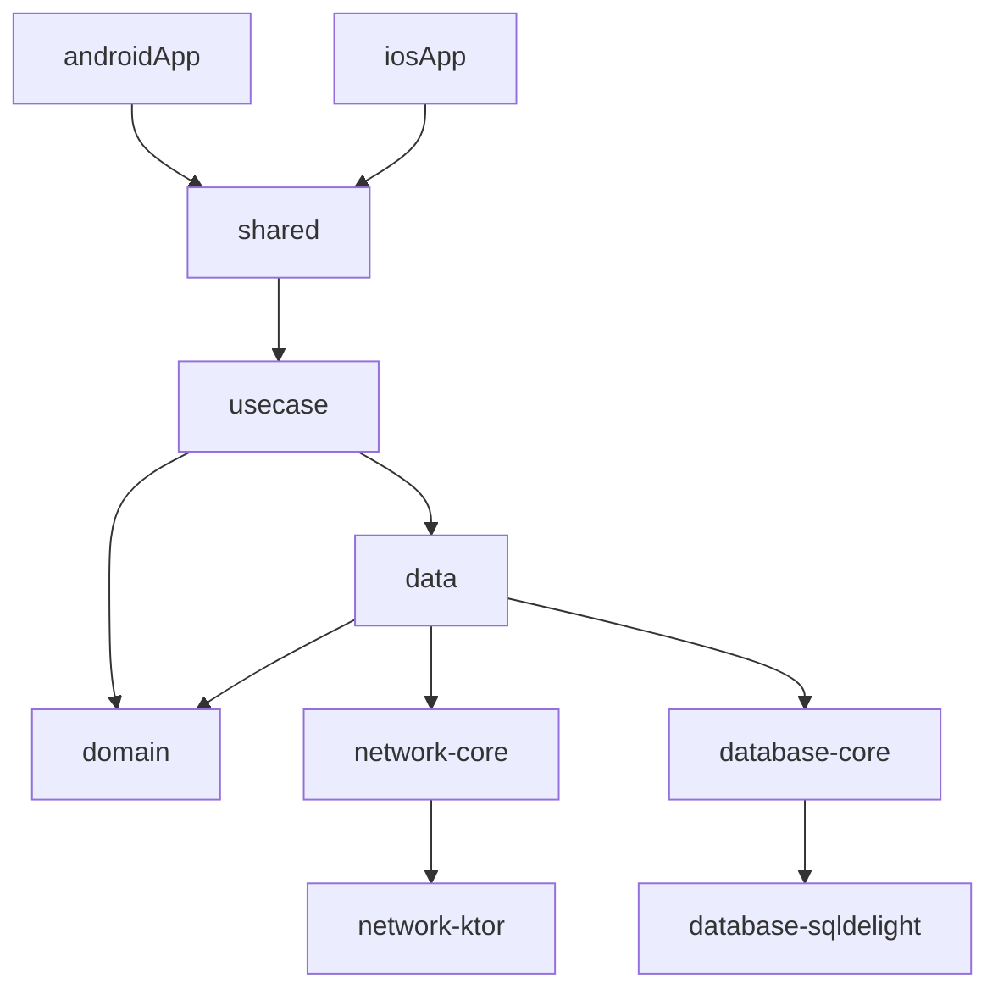

## 项目目标

- 使用 **Kotlin Multiplatform** 构建共享逻辑
- 使用 **Clean Architecture** 实现解耦、可测试、可维护的结构
- Android 与 iOS 各自拥有独立的 UI 层
- 代码结构模块化，可扩展、可测试

## 荐项目结构（模块层级）

```

📦 MyApp
├── build.gradle.kts              // 根项目
├── settings.gradle.kts
├── shared/                      // KMM Shared Module（Kotlin Multiplatform）
│   ├── domain/                  // 纯业务逻辑，无平台依赖
│   ├── data/                    // Repository实现、数据源
│   ├── core/                    // 通用工具类、类型定义
│   └── usecase/                 // 用例层
├── androidApp/                  // Android App
│   └── presentation/            // UI层，Jetpack Compose 或 XML
├── iosApp/                      // iOS App（SwiftUI 或 UIKit）
└── infrastructure/             // 网络、本地数据库、平台依赖（分平台实现）
    ├── network-core/           // 通用网络接口定义
    ├── network-ktor/           // KMM通用实现（使用Ktor）
    ├── database-core/          // 数据库接口定义
    ├── database-sqldelight/    // 使用 SQLDelight 跨平台实现
```

## Clean Architecture 层级划分

| 层级         | 模块                    | 说明                                         |
| ------------ | ----------------------- | -------------------------------------------- |
| Presentation | `androidApp` / `iosApp` | 各平台的 UI 展示逻辑，ViewModel 在这层       |
| Use Case     | `shared/usecase`        | 应用用例，业务流逻辑，直接调用 domain/repo   |
| Domain       | `shared/domain`         | Entity、Repository 接口定义、业务规则        |
| Data         | `shared/data`           | Repository实现，连接数据源（网络、数据库等） |
| Infra        | `infrastructure/*`      | 网络请求、本地存储等实际功能模块             |

## 技术选型建议

| 功能       | 技术                                                         | 是否支持 KMM     |
| ---------- | ------------------------------------------------------------ | ---------------- |
| 网络请求   | Ktor Client                                                  | ✅ 是             |
| 本地数据库 | SQLDelight                                                   | ✅ 是             |
| JSON解析   | Kotlinx.serialization                                        | ✅ 是             |
| DI注入     | Koin（KMM支持）或手动注入                                    | ✅ 是             |
| 多平台日志 | `Napier`                                                     | ✅ 是             |
| ViewModel  | Android: `androidx.lifecycle`, iOS: `Swift ObservableObject` | ❌（不共享）      |
| 单元测试   | `kotlin.test`、`MockK`                                       | ✅ 是（部分平台） |

## 示例模块依赖关系图



## 测试策略

- domain/usecase：纯 Kotlin 单元测试
- data：Mock 网络/数据库，测试 Repository 实现
- Android UI：使用 Jetpack Compose Test + Robolectric
- iOS UI：使用 SwiftUI 单元测试框架

## 推荐构建工具设置（Gradle）

- `build.gradle.kts` 使用 `kotlin("multiplatform")`
- 使用 KMM Plugin
- 设置 `sourceSets` 结构清晰（commonMain, androidMain, iosMain 等）
- Gradle Version Catalog 管理依赖

#### 其它

- 添加 Jacoco 测试覆盖率统计任务


